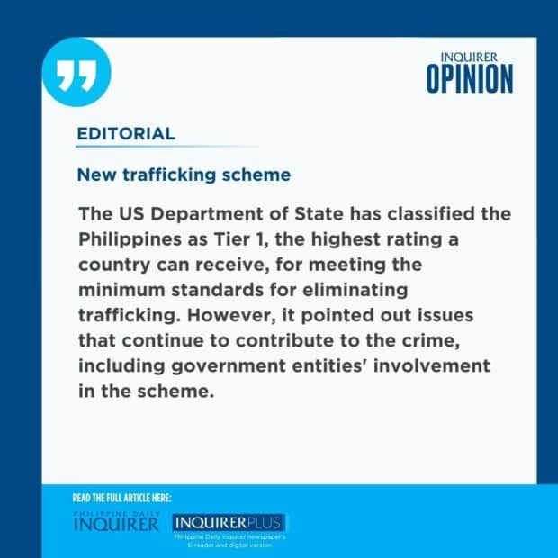

**EDITORIAL**

# New trafficking scheme

****Philippine Daily Inquirer / 04:30 AM December 08, 2024****

The arrest of 20 Filipino women trafficked to Cambodia for surrogacy shows how human trafficking in the country not only remains rife but has even evolved with the times. From mail-order brides in the 1980s to sex workers, laborers, domestic helpers, and drug mules in the 2000s, and now surrogate mothers, many Filipinos are still victimized by illegal recruiters who take advantage of their poverty.

The government rescued the 20 women in September—seven were sent home while 13, who were in various stages of pregnancy, were eventually meted a two-year sentence for violating Cambodia’s anti-trafficking law and surrogacy ban. The women were recruited online to travel to another Southeast Asian country but were instead sent to Cambodia, where surrogacy is banned.

The exploitation of surrogacy falls within the scope of human trafficking, Bureau of Immigration (BI) Commissioner Joel Anthony Viado said, as it coerces or deceives women into becoming surrogate mothers.

In October, the immigration bureau intercepted another victim who was attempting to leave the country for Georgia for business purposes but later confessed to being recruited as a surrogate mother. Per the BI, this was the seventh recorded case of surrogate mothers intercepted at airports, “showing a troubling trend of individuals being misled into these roles under false pretenses.”

## Hefty payments

The BI’s immigration protection and border enforcement section said surrogacy represents a new type of trafficking scheme where female victims are initially offered favorable living conditions—including hefty payments of at least half a million pesos after childbirth—but end up being exploited and abused. And, as the cases in Cambodia illustrate, the babies that these women carry also end up as victims—even before they are born—of a system that exploits the vulnerable.

The Philippines has passed several laws to protect Filipinos from traffickers: Republic Act No. 6955, or the anti-mail order bride law in 1990; RA 9208, or the Anti-Trafficking in Persons Act of 2003; and RA 10364, or the Expanded Anti-Trafficking in Persons Act of 2012, which established the Inter-Agency Council Against Trafficking. There is also RA 8042 or the Migrant Workers and Overseas Filipinos Act enacted in 1995 that regulates the recruitment of overseas workers and provides a mechanism for free legal assistance for victims of illegal recruitment.

The US Department of State has classified the Philippines as Tier 1, the highest rating a country can receive, for meeting the minimum standards for eliminating trafficking. However, it pointed out issues that continue to contribute to the crime, including government entities’ involvement in the scheme.

## Corrupt officials

“Some officials in law enforcement, immigration agencies, and other government entities are allegedly complicit in trafficking or allow traffickers to operate with impunity. Some corrupt officials allegedly accept bribes to facilitate migration outside of regular channels for overseas workers, operate sex trafficking establishments, facilitate production of fraudulent identity documents, or overlook irregular labor recruiters,” the 2024 Trafficking in Persons (TIP) Report on the Philippines stated.

Based on Department of Social Welfare and Development figures, there were at least 2,024 victim-survivors of TIP in 2023.

Another report released last year by the United Nations Office on Drugs and Crime (UNODC) said corruption was one of the core drivers of the human trafficking process. “The crime simply could not be committed on a large scale without corrupt officials abusing their position of authority and accepting bribes of money, favors or material goods,” UNODC said.

The TIP Report supports this finding, noting that “immigration officials, especially at lower levels, accepted bribes to facilitate or ignore trafficking crimes, including tampering with or producing fraudulent travel documents.”

## ‘One-strike’ policy

The BI has implemented a “one-strike” policy to discipline immigration officials implicated in corruption or trafficking cases and began rotating personnel in ports of entry and exit. Immigration procedures have also become stricter but caution must be made against overkill where legitimate travelers are the ones penalized instead of actual trafficking victims.

Aside from rooting out corrupt immigration personnel, the government must tighten online monitoring because this is where most crimes originate nowadays: with a seemingly innocent overseas job offer. The TIP Report also noted this, stating that the Philippines was not consistent in screening trafficking individuals involved in online scam operations.

Any Filipino who seeks greener pastures elsewhere, many of them women and minors, but does not have access to legitimate employment offers, is likely to fall victim to online recruiters who have evolved with the times. Their ploys have become more innovative and their offers more attractive. The government’s crackdown must continuously adapt to these challenges, too.\