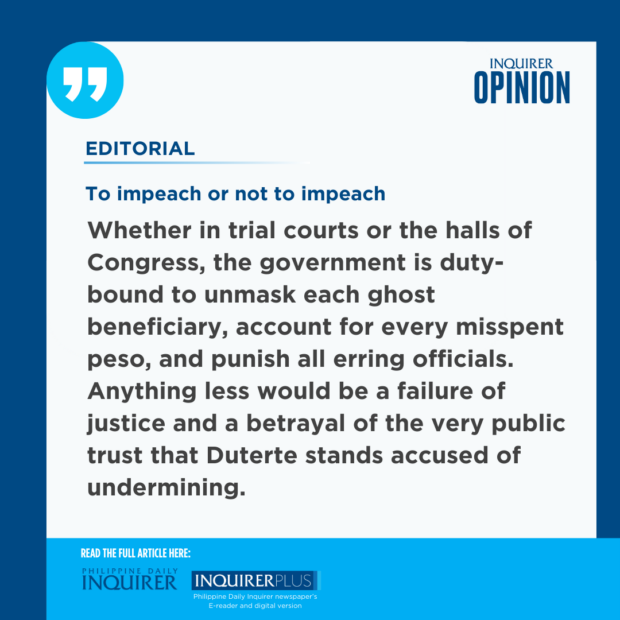

**EDITORIAL**

# To impeach or not to impeach

****Philippine Daily Inquirer / 04:40 AM December 10, 2024****

The road is long and uncertain for those seeking the removal of Vice President Sara Duterte via impeachment, but impeachment is by no means the only path in the pursuit of accountability for the P612.5 million in confidential funds allegedly misspent under her leadership.

The reality is that impeachment is not just a constitutional instrument to make high officials answerable for wrongdoing. Too often, it serves as a bargaining chip for partisan gain or monetary benefit; in other words—a political tool. But the allegations leveled at Duterte, being imbued with public interest, require a legal response and potentially, a judicial reckoning.

Which results in a glaring contradiction: Why must Congress seek a political remedy for a fundamentally criminal matter? More importantly, why must the alleged squandering of taxpayer money be left to politicians’ whims and agenda?

Impeachment, as our history has shown, has its uses and advantages, but it is a double-edged sword that one must wield with an abundance of caution.

## Highest treachery

The two impeachment complaints filed against the Vice President last week offered contrasting approaches in their bid to oust the second most powerful official of the land. The first complaint, filed by civil society leaders and a relative of a drug war victim, employed an all-but-the-kitchen-sink strategy, heaping on Duterte a litany of accusations that invoked all possible grounds for impeachment, except treason. The second, filed by progressive activists, elected to zero in on one—betrayal of public trust—as it focused on the Office of the Vice President’s (OVP) 11-day spending spree of P125 million in confidential funds in December 2022.

On top of this, both complaints took issue with the unaccounted spending in 2023 of P375 million and P112.5 million in the hard-to-audit secret funds by the OVP and the Department of Education (DepEd), respectively, during Duterte’s tenure.

What stands out in the allegations is the chilling resemblance to other funding shenanigans, like the P10-billion pork barrel scam masterminded by Janet Lim-Napoles, the country’s poster child for large-scale corruption, who is now serving time for multiple convictions while still on trial for other charges.

## Ghost beneficiaries

In a wide-ranging conspiracy that implicated top lawmakers and officials, Napoles was accused—and found guilty in some cases, including plunder, for orchestrating the diversion of congressional allocations to ghost projects with fake beneficiaries.

A similar trail of questionable transactions has now emerged in Duterte’s funding controversy, including the curious cases of Mary Grace Piattos and Kokoy Villamin, who are both listed as signatories to receipts used by the OVP and DepEd to liquidate their respective expenditures.

The Philippine Statistics Authority has since confirmed suspicions that Piattos and Villamin do not exist, at least in its birth, marriage or death records, and the agency is now in the process of checking hundreds of other signatories. It only adds to the cloud of doubt surrounding Duterte’s use of public funds that she has responded to congressional inquiries with stonewalling tactics and defiance.

Let us not forget that confidential funds are intended for pressing national security concerns. That the OVP and DepEd, both civilian agencies, were even granted these funds reflects serious flaws and misplaced priorities in public spending. And like the pork barrel scam, the Duterte scandal demonstrates the dangers of intertwining political and financial interests in the budgeting process and the absence of robust oversight mechanisms in the use of such appropriations.

## Misspent peso

But the stakes are too high for this issue to be brushed aside as partisan squabbling, as President Marcos suggested when he said impeaching Duterte was a “waste of time.”

On the contrary, the House of Representatives and the Senate must act decisively on the impeachment complaints, lest they be seen as enablers of malfeasance. If anything, their inaction would render the House inquiries a toothless spectacle. As former Bayan Muna Rep. Teddy Casiño put it: “[This] impeachment complaint is a challenge to Congress to show its independence, that it can stand on the side of the people.”

It’s too early to say whether the President’s position has doomed the chances of Duterte’s impeachment, but there is precedent for the House and the Senate defying the presidential line.

In either case, her critics should know that impeachment is not the only way to hold Duterte to account—the VP is not immune from criminal suits.

Whether in trial courts or the halls of Congress, the government is duty-bound to unmask each ghost beneficiary, account for every misspent peso, and punish all erring officials. Anything less would be a failure of justice and a betrayal of the very public trust that Duterte stands accused of undermining.